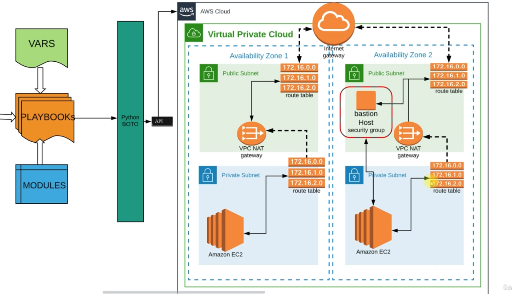

## Ansible

Ansible is an open-source automation tool that simplifies configuration management, application deployment, and task automation. It uses a declarative language to describe system configurations, making it easy to understand and maintain. This document provides a brief guide on using Ansible to automate AWS infrastructure.

Here is a architectural diagram of the achieved architecture 

